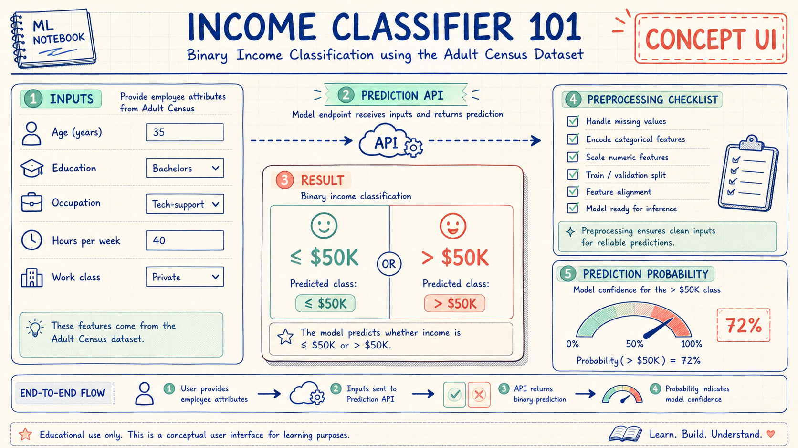
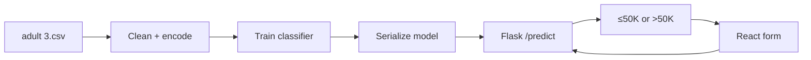

<div align="center">

# INCOME CLASSIFIER 101

### A full-stack lesson in turning census rows into a binary prediction


</div>

---

> [!NOTE]
> This is a labeled **concept UI**, not a live application screenshot. It visualizes the repository's real input → Flask API → binary classifier flow.



## Lesson objective

Build and understand a complete classification loop that predicts one of two income brackets from Adult Census-style demographic and work attributes:

```text
class 0  →  income ≤ $50K
class 1  →  income > $50K
```

Despite the repository name, this is **classification**, not a numeric salary estimator. That distinction matters: the model returns a category rather than a dollar amount.

## Flip through the pipeline



## Index cards

| Card | What to learn |
|---|---|
| Dataset | How tabular demographic and employment fields are represented |
| Preprocessing | Why categorical encoders must match training and inference |
| Modeling | How Logistic Regression or Random Forest separates two classes |
| Serialization | How Joblib carries trained artifacts into an API process |
| Serving | How Flask validates inputs and produces JSON |
| Interface | How React converts a form into a prediction request |

## Notebook layout

```text
Employee-salary-prediction-Basic/
├── adult 3.csv             Adult Income-style records
├── notebooks/              exploration and experimentation
├── backend/
│   ├── app.py              Flask prediction service
│   ├── pipeline/           model training workflow
│   ├── model/              serialized artifacts
│   ├── utils/              shared helpers
│   └── requirements.txt
└── frontend/
    ├── src/                React components and API integration
    ├── public/
    └── package.json
```

## Start the lesson

### Backend

```bash
git clone https://github.com/QizarBilal/Employee-salary-prediction-Basic.git
cd Employee-salary-prediction-Basic/backend
python -m venv .venv
```

Activate the virtual environment, then:

```bash
pip install -r requirements.txt
python app.py
```

If model artifacts are absent or intentionally retrained, run the training script under `backend/pipeline/` first and confirm the output paths expected by `app.py`.

### Frontend

In another terminal:

```bash
cd frontend
npm install
npm run dev
```

The React/Vite client includes Tailwind styling, responsive form behavior, and light/dark presentation.

## The alignment rule

The most important invariant in this project is not visual—it is feature alignment.

```text
training column order
      =
inference column order
      =
encoder expectations
```

Changing a form field, category vocabulary, encoder, or feature order requires retraining or coordinated artifact updates. A request can be syntactically valid and still produce a meaningless result when that contract drifts.

## Responsible classroom notes

The Adult Income dataset contains sensitive demographic attributes and reflects historical social conditions. Therefore:

- Do not use this model for employment, lending, benefits, or compensation decisions.
- Treat accuracy as insufficient without subgroup and fairness analysis.
- Explain that a class label is not an assessment of a person's worth or potential.
- Avoid exposing raw personal records through logs or API responses.
- Document dataset provenance, preprocessing, and evaluation splits.

This repository is best used to learn integration and classification mechanics—not to automate consequential decisions.

## Study checks

- Test both classes with known validation examples.
- Confirm missing and unknown categories fail clearly.
- Keep CORS restricted to expected client origins outside development.
- Verify preprocessing artifacts load from clean environments.
- Record precision, recall, F1, confusion matrix, and ROC-AUC—not accuracy alone.
- Remove committed `node_modules` in a future maintenance pass and rely on lockfiles.

## License

Released under the [MIT License](./LICENSE). The underlying Adult dataset may carry its own source terms; verify those terms before redistributing or repurposing the data.

---

<div align="center">

**Learn the pipeline. Question the data. Use the prediction carefully.**

</div>
